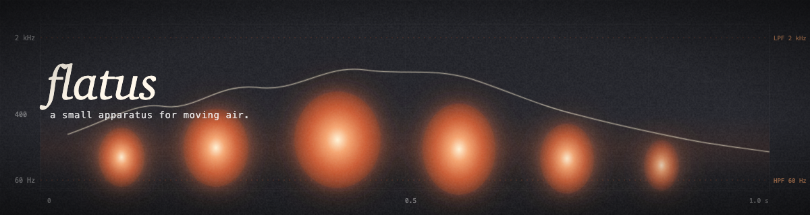
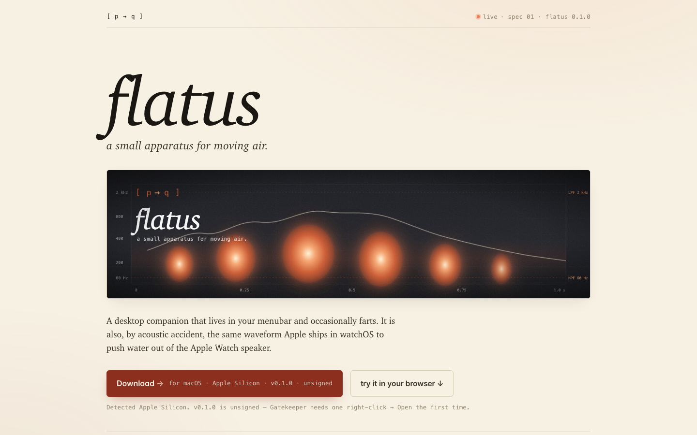
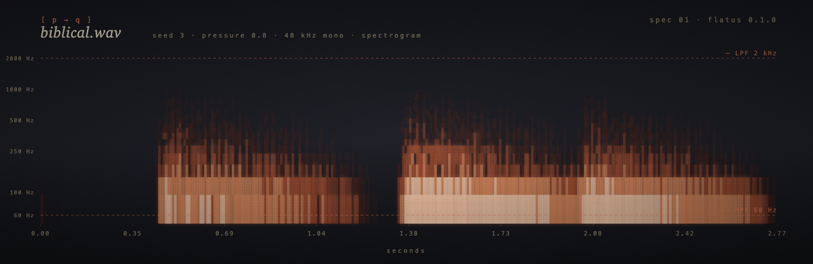
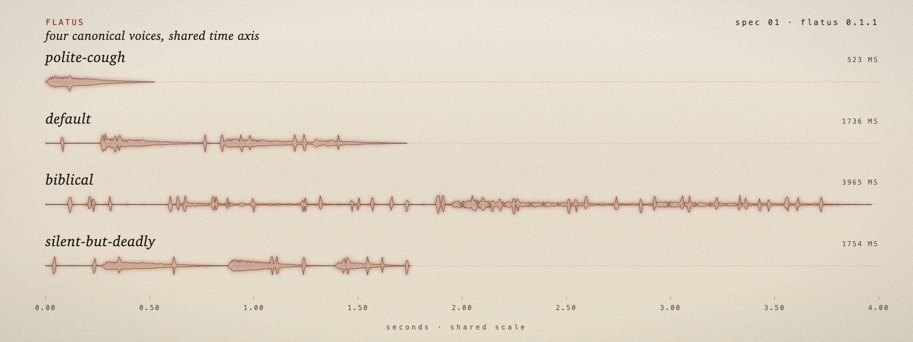
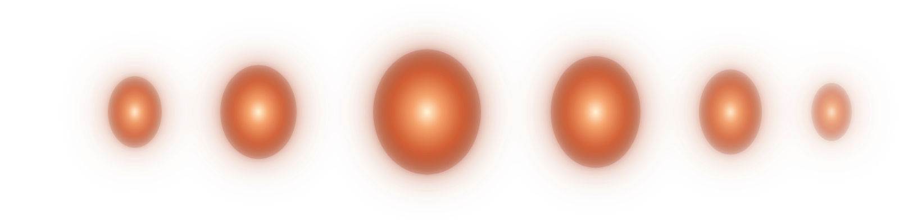
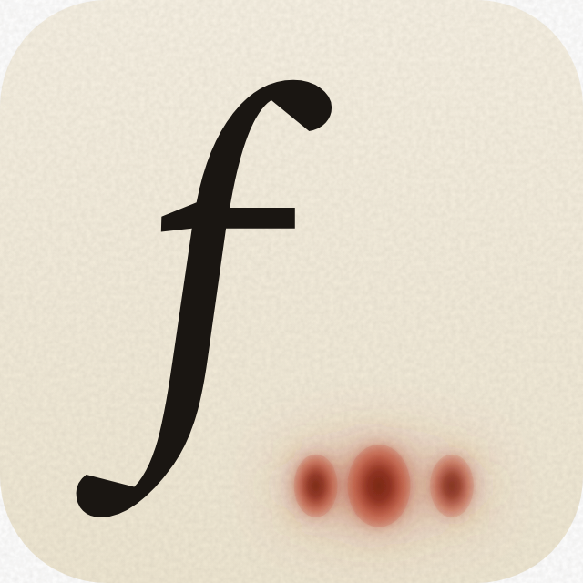
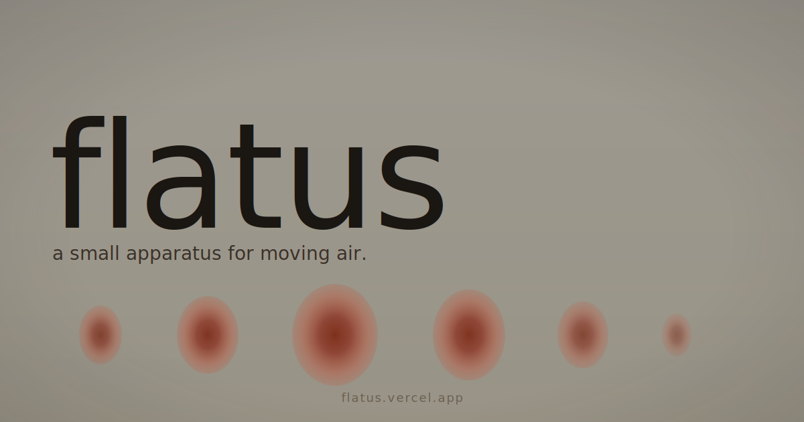

<p align="center">
  
</p>

# flatus

A small thing that lives in your menubar and occasionally farts.

It's also, by acoustic accident, the same waveform Apple uses in watchOS to push water out of the Apple Watch speaker. See [`docs/ACOUSTICS.md`](docs/ACOUSTICS.md) if you want receipts.

→ **[Try it in your browser](https://flatus.vercel.app/)** — the landing page runs the same Rust synthesis core, compiled to WebAssembly. Same inputs, byte-identical WAV.

**Desktop (macOS Apple Silicon):** current build is **[v0.2.0](https://github.com/p-to-q/flatus/releases/tag/v0.2.0)** — DMG `flatus_0.2.0_aarch64.dmg` and `flatus-v0.2.0-aarch64.app.zip`. The [site download CTA](https://flatus.vercel.app/) points at the same tag; the [one-liner installer](https://flatus.vercel.app/install.sh) resolves whatever GitHub lists as the newest release and pulls the attached `.dmg`.

<p align="center">
  <a href="https://flatus.vercel.app/">
    
  </a>
  <br/>
  <em><sub>the landing page synthesizes live in your browser via a 62 KB wasm bundle.</sub></em>
</p>

## Listen

Four canonical voices, rendered by the deterministic `generate-goldens` binary and CDN-hosted alongside the website. Click to play in your browser (or right-click → save):

- ▸ [polite-cough.wav](https://flatus.vercel.app/samples/v0.4/polite-cough.wav) · _short, dry, plausibly deniable_ · 49 KB
- ▸ [default.wav](https://flatus.vercel.app/samples/v0.4/default.wav) · _the canon. wet enough, not so wet_ · 163 KB
- ▸ [biblical.wav](https://flatus.vercel.app/samples/v0.4/biblical.wav) · _slow, low, devastating_ · 372 KB
- ▸ [silent-but-deadly.wav](https://flatus.vercel.app/samples/v0.4/silent-but-deadly.wav) · _exactly what it says_ · 164 KB

For an A/B with the pre-realism cut, the v0.3 archive sits alongside, byte-identical to the WAVs flatus shipped before [`docs/REALISM.md`](docs/REALISM.md) landed: [biblical](https://flatus.vercel.app/samples/v0.3/biblical.wav) · [default](https://flatus.vercel.app/samples/v0.3/default.wav) · [polite-cough](https://flatus.vercel.app/samples/v0.3/polite-cough.wav) · [silent-but-deadly](https://flatus.vercel.app/samples/v0.3/silent-but-deadly.wav) ([manifest](https://flatus.vercel.app/samples/v0.3/manifest.json)).

<p align="center">
  
  <br/>
  <em><sub>real spectrogram of <code>biblical.wav</code> — one of the four pinned golden fixtures. seed=3, pressure=0.8.</sub></em>
</p>

## Install

### Option A — one-liner installer (macOS Apple Silicon, recommended)

```sh
curl -fsSL https://flatus.vercel.app/install.sh | bash
```

Resolves the latest GitHub release, downloads the DMG, copies `flatus.app` into `/Applications`, and clears the macOS browser-quarantine xattr — all in one go. The script is short; read it first if you'd rather not pipe a remote URL to bash: [`apps/web/install.sh`](apps/web/install.sh).

### Option A′ — pre-built `.dmg` by hand

Grab the **unsigned** `flatus_*.dmg` from the [latest release](https://github.com/p-to-q/flatus/releases/tag/v0.2.0) (or the [full list](https://github.com/p-to-q/flatus/releases)). Open it, drag `flatus.app` into the `Applications` folder shortcut, eject the disk. Then see [First launch](#first-launch).

Prefer to skip the DMG step? The same release also ships a `flatus-*.app.zip` — unzip and drag the `.app` into `/Applications/` yourself.
If you're just trying to use the app, this is the only part that matters: install the app, clear quarantine once if macOS asks, then use the tray menu to get to `Fart now` or `Show window`.

### Option B — from source (any platform, CLI only on non-macOS)

You need: `git`, `rustc` ≥ 1.78 (via [rustup](https://rustup.rs/)), and `cargo`. On Linux also install `libasound2-dev` so `cpal` can find ALSA.

```sh
git clone https://github.com/p-to-q/flatus
cd flatus
cargo install --path crates/fart-synth
```

This installs **two binaries** into `~/.cargo/bin/`:
- `fart` — the CLI you actually run
- `generate-goldens` — regenerates the deterministic golden fixtures (you almost never need this)

> Note: `cargo install flatus` does **not** work — the crate isn't on crates.io yet. The `--path crates/fart-synth` form is the only way today.

### Option C — build the menubar app from source (macOS only)

Adds: `node` ≥ 20, `pnpm` ≥ 9, Xcode Command Line Tools (`xcode-select --install`).

```sh
cd apps/desktop
pnpm install
pnpm tauri build
open ../../target/release/bundle/macos/flatus.app
```

The compiled bundle lives at `target/release/bundle/macos/flatus.app` (workspace root, not under `apps/desktop/`).

## First launch

The `.app` is **unsigned** (no Apple Developer cert in v0.2 yet). On macOS 15 (Sequoia) and 26 (Tahoe), browser-downloaded DMGs carry a `com.apple.quarantine` xattr that triggers a misleading **"flatus.app is damaged and can't be opened"** dialog — even though the bundle is fine.

**One-liner (recommended).** Paste this into Terminal — it downloads the latest DMG, installs `flatus.app` into `/Applications`, and clears the quarantine xattr in one shot:

```sh
curl -fsSL https://flatus.vercel.app/install.sh | bash
```

The script is short and worth a look before piping it to bash: [`apps/web/install.sh`](apps/web/install.sh).

<details>
<summary><strong>Or do it by hand</strong></summary>

1. Drag `flatus.app` into `/Applications` as usual.
2. In Terminal, strip the quarantine xattr from the installed app:

   ```sh
   xattr -cr /Applications/flatus.app
   ```
3. Double-click `flatus.app`. Next launches don't need step 2.

UI-only path: open **System Settings → Privacy & Security**, scroll to the bottom, and click **Open Anyway** next to the "flatus.app was blocked" notice. Re-open the app and confirm.
</details>

After that, `flatus` runs as a menubar-first app: **no dock icon**, a small tray icon in your menubar.

- **Click the tray** → the native menu (`Fart now`, `Show window`, `Quit`).
- **Show window** → the fuller desktop surface for personality, output cap, seed preview, quiet hours, and first-launch help.
- **Right-click** still works as a fallback menu.

## Use (CLI)

```sh
fart                                # one-shot through your default output device
fart --personality biblical         # pick a voice
fart --seed 42                      # reproducible — same seed always renders the same fart
fart --render out.wav               # silent: just write a 16-bit mono 48 kHz WAV
fart --demo /tmp/flatus-demo        # render all four voices into a folder; print summary
fart --headphones                   # tighter −18 dBFS cap for headphones
fart --list-personalities           # show the four canonical voices with descriptions
fart --help
```

## Personalities

<p align="center">
  
  <br/>
  <em><sub>same shared scale for all four personalities; durations are real.</sub></em>
</p>

- `polite-cough` — short, dry, plausibly deniable
- `default` — the canon
- `biblical` — slow, low, devastating
- `silent-but-deadly` — exactly what it says

Add a fifth by appending one row to [`crates/fart-synth/src/personalities.rs`](crates/fart-synth/src/personalities.rs). _The directory listing is the bestiary._

## In the browser

The [landing page](https://flatus.vercel.app/) compiles `crates/fart-synth` to `wasm32-unknown-unknown` and exposes one function: `renderWav(personality, seed, pressure, headphones) → Uint8Array`. The bundle is **62 KB of WASM** plus 10 KB of JS glue. No reimplementation, no parity drift — the bytes the page plays are the bytes the CLI would write.

Build the bundle locally:

```sh
cargo build -p fart-synth --target wasm32-unknown-unknown --lib --release
wasm-bindgen --target web --no-typescript --out-dir apps/web/wasm \
    target/wasm32-unknown-unknown/release/fart_synth.wasm
```

## Roadmap

- [x] First desktop release ([v0.2.0](https://github.com/p-to-q/flatus/releases/tag/v0.2.0))
- [x] Live synth in the browser
- [ ] Cease-and-desist from Apple's lawyers (re: US 9,451,354 et seq.)
- [ ] Speaker manufacturer warranty claims department
- [ ] IRB approval for the cleaning-efficacy study
- [ ] Bluetooth headphone hearing-protection litigation
- [ ] Notarized DMG (we'll get to it)
- [ ] Updated fart physics

## Status

**v0.2.0** — current release, still unsigned on macOS Apple Silicon. First user-facing release of the desktop shell: the menubar app opens, the first-launch help dismisses cleanly, the seed input plays audible previews, and `Fart now` from both the tray and the window stays responsive while audio renders off-thread. The `fart-synth` core and `fart` CLI build and test green on Linux and macOS, and the synthesis core also compiles to wasm32 and powers the in-browser preview at [flatus.vercel.app](https://flatus.vercel.app/). First launch on macOS 15+ may still need a one-shot `xattr -cr /Applications/flatus.app` to clear the browser-quarantine xattr (see [First launch](#first-launch)). See [`CHANGELOG.md`](CHANGELOG.md) and [release notes](https://github.com/p-to-q/flatus/releases/tag/v0.2.0).

## Docs

- [`README.md`](README.md) — you are here
- [`PLAN.md`](PLAN.md) — the internal plan (philosophy, architecture, milestones)
- [`docs/ACOUSTICS.md`](docs/ACOUSTICS.md) — the citation-backed plausibility writeup
- [`docs/AUDIO_BASELINE.md`](docs/AUDIO_BASELINE.md) — the current reference set, parity checks, and manual signoff flow
- [`docs/REALISM.md`](docs/REALISM.md) — v0.4 research: why v0.3 sounded rendered + which three knobs we turned
- [`docs/PRODUCT_BACKLOG.md`](docs/PRODUCT_BACKLOG.md) — post-launch cleanup, interaction, and product-quality backlog
- [`docs/PLUGIN_RESEARCH.md`](docs/PLUGIN_RESEARCH.md) — cadence, optional extensions, and plugin-shape research for the next phase
- [`docs/ENGINEERING.md`](docs/ENGINEERING.md) — conventions
- [`docs/marks/`](docs/marks/) — brand kit (wordmark, signature, monogram, OG card)

### Brand kit

Raster previews of the vector sources in [`docs/marks/`](docs/marks/) (each asset has an SVG sibling there). The OG card is also wired on the live site as `og:image` / `twitter:image`.

<table>
  <thead>
    <tr>
      <th align="center" width="50%">Wordmark</th>
      <th align="center" width="50%">Signature</th>
    </tr>
  </thead>
  <tbody>
    <tr>
      <td align="center" valign="middle"></td>
      <td align="center" valign="middle"></td>
    </tr>
    <tr>
      <th align="center" colspan="2">Monogram</th>
    </tr>
    <tr>
      <td align="center" valign="middle" colspan="2"></td>
    </tr>
    <tr>
      <th align="center" colspan="2">Open Graph card</th>
    </tr>
    <tr>
      <td align="center" valign="middle" colspan="2"></td>
    </tr>
  </tbody>
</table>

## License

Apache-2.0.
