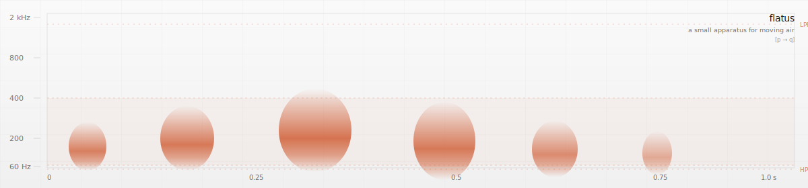

<p align="center">
  
</p>

# flatus

A small thing that lives in your menubar and occasionally farts.

It's also, by acoustic accident, the same waveform Apple uses in watchOS to push water out of the Apple Watch speaker. See [`docs/ACOUSTICS.md`](docs/ACOUSTICS.md) if you want receipts.

## Install

```sh
cargo install --path crates/fart-synth   # from this repo
# (once published to crates.io)
# cargo install flatus
```

(Yes, `cargo install`. Yes, it's a fart machine. Yes, it's written in Rust. We did not plan this.)

## Use

```sh
fart                            # one shot, from the terminal
fart --personality biblical
fart --seed 42                  # reproducible
fart --render out.wav           # don't play; write a WAV
fart --list-personalities

# menubar companion (Tauri):
cd apps/desktop && pnpm install && pnpm tauri dev
```

**Tray click → fart.** Right-click (or ⌘-click) → settings.

## Personalities

- `polite-cough` — short, dry, plausibly deniable
- `default` — the canon
- `biblical` — slow, low, devastating
- `silent-but-deadly` — exactly what it says

## Roadmap

- [x] First release
- [ ] Cease-and-desist from Apple's lawyers (re: US 9,451,354 et seq.)
- [ ] Speaker manufacturer warranty claims department
- [ ] IRB approval for the cleaning-efficacy study
- [ ] Bluetooth headphone hearing-protection litigation
- [ ] Notarized DMG (we'll get to it)
- [ ] Updated fart physics

## Status

v0.1.0 — **unsigned**, macOS only, Apple Silicon. First launch on macOS needs a Gatekeeper bypass (right-click → Open). The CLI works on Linux too in theory but is not tested there. See [`CHANGELOG.md`](CHANGELOG.md).

## Docs

- [`README.md`](README.md) — you are here
- [`PLAN.md`](PLAN.md) — the internal plan (philosophy, architecture, milestones)
- [`docs/ACOUSTICS.md`](docs/ACOUSTICS.md) — the citation-backed plausibility writeup
- [`docs/ENGINEERING.md`](docs/ENGINEERING.md) — conventions

## License

Apache-2.0.

A `[p → q]` project. We're interested in the arrow.
