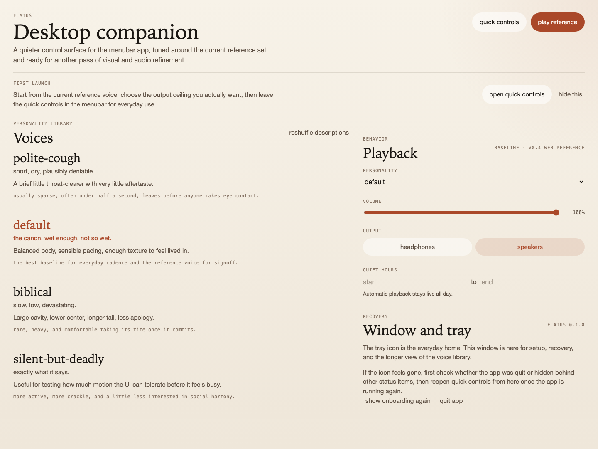

<p align="center">
  
</p>

# flatus

A small thing that lives in your menubar and occasionally farts.

It's also, by acoustic accident, the same waveform Apple uses in watchOS to push water out of the Apple Watch speaker. See [`docs/ACOUSTICS.md`](docs/ACOUSTICS.md) if you want receipts.

**Desktop (macOS Apple Silicon):** [download the latest release](https://github.com/p-to-q/flatus/releases/tag/v0.2.1) or use the [one-line installer](https://flatus.vercel.app/install.sh).

→ **[Or try it in your browser](https://flatus.vercel.app/)**

## Personality

There are four canonical ways to do this:

- `polite-cough` — short, dry, plausibly deniable
- `default` — the canon. wet enough, not so wet
- `biblical` — slow, low, devastating
- `silent-but-deadly` — exactly what it says

For what makes a fart unwelcome is not its voice, but its odour; the ear, left to its own devices, seldom takes offence. So these four tempers keep their character. The copy may wander, the seed may turn the wheel, but each personality returns, in the end, to its own familiar nature.

<p align="center">
  
</p>

## Install

```sh
curl -fsSL https://flatus.vercel.app/install.sh | bash
```

That puts `flatus.app` in `/Applications` and clears the quarantine xattr that can trigger the fake "app is damaged" dialog. If you prefer doing it manually, grab the **unsigned** `.dmg` or `.app.zip` from the [latest release](https://github.com/p-to-q/flatus/releases/tag/v0.2.1).

## First launch

`v0.2.1` is still **unsigned**. If macOS objects, run:

```sh
xattr -cr /Applications/flatus.app
```

Or use **System Settings -> Privacy & Security -> Open Anyway** after the first blocked attempt.

## Current behavior

`flatus` is menubar-first: no Dock icon, a small tray icon, and one fuller window for setup and recovery.

- **Click the tray** -> native menu: `Fart now`, `Show window`, `Quit`
- **Show window** -> personality, volume, output mode, quiet hours, and help
- **Auto play** defaults to `off`
- **Quiet hours** suppress automatic playback only; manual `Fart now` still works
- **Right-click** remains a fallback path to the native menu

## Listen

Four canonical voices, rendered by the deterministic `generate-goldens` binary and hosted alongside the site:

- ▸ [polite-cough.wav](https://flatus.vercel.app/samples/v0.4/polite-cough.wav) · _short, dry, plausibly deniable_
- ▸ [default.wav](https://flatus.vercel.app/samples/v0.4/default.wav) · _the canon. wet enough, not so wet_
- ▸ [biblical.wav](https://flatus.vercel.app/samples/v0.4/biblical.wav) · _slow, low, devastating_
- ▸ [silent-but-deadly.wav](https://flatus.vercel.app/samples/v0.4/silent-but-deadly.wav) · _exactly what it says_

For an A/B with the pre-realism cut, the v0.3 archive still sits alongside: [biblical](https://flatus.vercel.app/samples/v0.3/biblical.wav) · [default](https://flatus.vercel.app/samples/v0.3/default.wav) · [polite-cough](https://flatus.vercel.app/samples/v0.3/polite-cough.wav) · [silent-but-deadly](https://flatus.vercel.app/samples/v0.3/silent-but-deadly.wav) · [manifest](https://flatus.vercel.app/samples/v0.3/manifest.json)

## Audio note

Desktop manual playback is aligned to the **website specimen reference**: one reference event, fixed preview pressure, and the current seed. The downloadable canonical `.wav` files are a separate pinned regression set used for deterministic release checks. The full baseline and signoff flow live in [`docs/AUDIO_BASELINE.md`](docs/AUDIO_BASELINE.md).

## Build

To build from source you need `git`, `rustc` >= 1.78, and `cargo`. For the desktop app on macOS also add `node` >= 20, `pnpm` >= 9, and Xcode Command Line Tools.

```sh
git clone https://github.com/p-to-q/flatus
cd flatus
cargo install --path crates/fart-synth
cd apps/desktop
pnpm install
pnpm tauri build
```

## Use (CLI)

```sh
fart                                # one-shot through your default output device
fart --personality biblical         # pick a voice
fart --seed 42                      # reproducible — same seed always renders the same fart
fart --render out.wav               # silent: just write a 16-bit mono 48 kHz WAV
fart --demo /tmp/flatus-demo        # render all four voices into a folder; print summary
fart --headphones                   # tighter -18 dBFS cap for headphones
fart --list-personalities           # show the four canonical voices with descriptions
fart --help
```

## In the browser

The [landing page](https://flatus.vercel.app/) runs the same synthesis core as the desktop app. For the deep version of that sentence, start with [`docs/REALISM.md`](docs/REALISM.md) and [`docs/ACOUSTICS.md`](docs/ACOUSTICS.md).

## Known limitations

- macOS desktop build is Apple Silicon only
- The app is still unsigned, so first launch may require clearing quarantine
- The menubar shell is intentionally minimal; if tray or transparent-window behavior varies on a given macOS build, `Show window` and the native menu are still the recovery path

## Roadmap

- [x] First desktop release ([v0.2.1](https://github.com/p-to-q/flatus/releases/tag/v0.2.1))
- [x] Live synth in the browser
- [ ] Cease-and-desist from Apple's lawyers (re: US 9,451,354 et seq.)
- [ ] Speaker manufacturer warranty claims department
- [ ] IRB approval for the cleaning-efficacy study
- [ ] Bluetooth headphone hearing-protection litigation
- [ ] Notarized DMG (we'll get to it)
- [ ] Updated fart physics

## Docs

- [`docs/ACOUSTICS.md`](docs/ACOUSTICS.md) — why the Apple Watch precedent matters, and where the evidence stops
- [`docs/AUDIO_BASELINE.md`](docs/AUDIO_BASELINE.md) — fixture parity, specimen reference, and release signoff
- [`docs/REALISM.md`](docs/REALISM.md) — how we pushed the synth toward sounding less obviously rendered
- [`docs/PRODUCT_BACKLOG.md`](docs/PRODUCT_BACKLOG.md) — cleanup, interaction, and next-phase product work
- [`docs/ENGINEERING.md`](docs/ENGINEERING.md) — conventions
- [`docs/PLAN.md`](docs/PLAN.md) — the longer internal rationale and architecture

## License

Apache-2.0.
